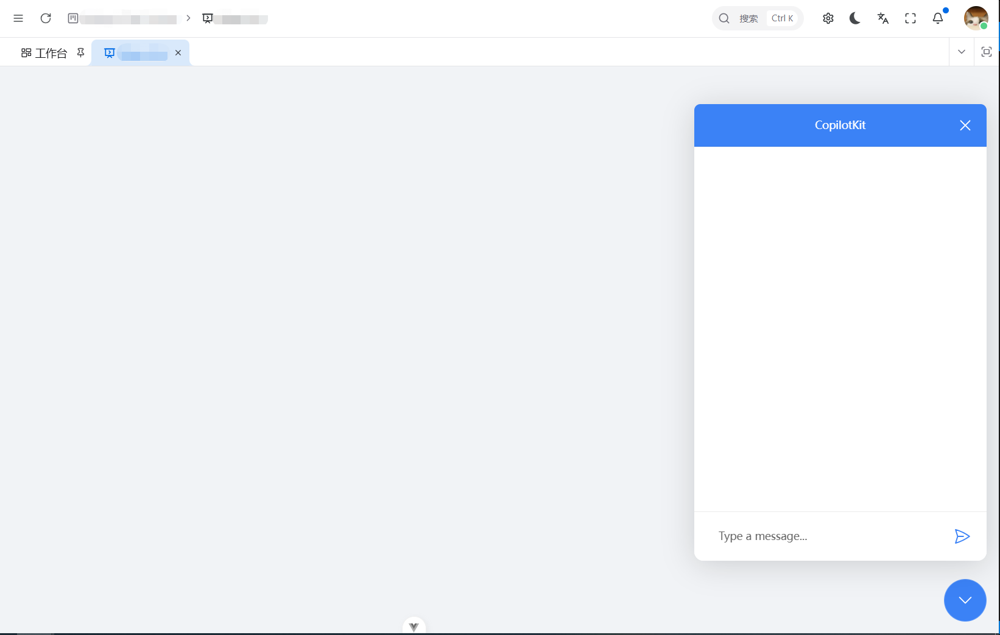

[English](./README.md) | [中文](./README.zh.md)

| Package                         | NPM Version                                                                                                                                                                 |
| :------------------------------ | :-------------------------------------------------------------------------------------------------------------------------------------------------------------------------- |
| `@dingdayu/vue-copilotkit`      | _new unified package (core + ui)_                                                                                                                                           |
| `@dingdayu/vue-copilotkit-core` | [](https://www.npmjs.com/package/@dingdayu/vue-copilotkit-core) |
| `@dingdayu/vue-copilotkit-ui`   | [](https://www.npmjs.com/package/@dingdayu/vue-copilotkit-ui)       |

---

# Vue Copilotkit

_This project is forked from https://github.com/fe-51shebao/vue-copilotkit_

> A Vue implementation based on the React UI library of <a href="https://github.com/CopilotKit/CopilotKit" target="_blank">CopilotKit</a>

The unified package `@dingdayu/vue-copilotkit` is recommended for new projects:

```bash
pnpm add @dingdayu/vue-copilotkit
```

For split usage, `@dingdayu/vue-copilotkit-core` and `@dingdayu/vue-copilotkit-ui` are also available:

```bash
pnpm add @dingdayu/vue-copilotkit-core @dingdayu/vue-copilotkit-ui
```

## Quick Start

```bash
pnpm install
pnpm dev
pnpm build
```

- `pnpm dev`: starts the Vue example app from the workspace root
- `pnpm -C examples dev:runtime`: starts the local CopilotKit runtime used by the demo app
- `pnpm typecheck`: validates the TypeScript workspace

## Repository Structure

| Path                         | Purpose                                                 |
| :--------------------------- | :------------------------------------------------------ |
| `packages/vue-core`          | Core provider, context, and runtime-facing hooks        |
| `packages/vue-ui`            | Chat UI, popup/sidebar components, and textarea exports |
| `examples`                   | Vue 3 + Vite demo app with practical scenarios          |
| `README.md` / `README.zh.md` | Public project documentation in English and Chinese     |

### Package Notes

- `@dingdayu/vue-copilotkit-core`: install this when you need `CopilotKit`, actions, readable state, and low-level hooks.
- `@dingdayu/vue-copilotkit-ui`: install this when you need ready-made chat UI such as `CopilotPopup`, `CopilotSidebar`, `CopilotChat`, or `CopilotTextarea`.
- The old standalone `@dingdayu/vue-textarea` package has been merged into `@dingdayu/vue-copilotkit-ui`.
- The former shared `vite-config` package has been removed; each package now owns its local Vite build config.

## Example

### Server

Install dependencies

```bash
pnpm add @copilotkit/runtime @ai-sdk/openai-compatible
```

Create `index.mjs` file (or use `"type": "module"` in `package.json`).

```ts
import { createServer } from 'node:http'
import { CopilotRuntime, copilotRuntimeNodeHttpEndpoint } from '@copilotkit/runtime'
import { BuiltInAgent } from '@copilotkit/runtime/v2'
import { createOpenAICompatible } from '@ai-sdk/openai-compatible'

const provider = createOpenAICompatible({
  name: 'openai-compatible',
  apiKey: process.env.OPENAI_API_KEY,
  baseURL: process.env.OPENAI_BASE_URL || 'https://api.openai.com/v1'
})

const runtime = new CopilotRuntime({
  agents: {
    default: new BuiltInAgent({
      model: provider.chatModel(process.env.OPENAI_MODEL || 'deepseek-chat'),
      forwardSystemMessages: true
    })
  }
})

const handler = copilotRuntimeNodeHttpEndpoint({
  endpoint: '/copilotkit',
  runtime
})

const server = createServer((req, res) => handler(req, res))
server.listen(4000, () => {
  console.log('Listening at http://localhost:4000/copilotkit')
})
```

Run `node index.mjs`.

## CopilotKit v2 API Reference Notes

Official reference: https://docs.copilotkit.ai/reference/v2

This repo now follows the v2 single-route protocol shape used by the runtime endpoint:

```json
{
  "method": "agent/run",
  "params": { "agentId": "default" },
  "body": {
    "threadId": "...",
    "runId": "...",
    "messages": [],
    "tools": [],
    "context": [],
    "state": {},
    "forwardedProps": {}
  }
}
```

Supported single-route `method` values in v2 runtime are:

- `agent/run`
- `agent/connect`
- `agent/stop`
- `info`
- `transcribe`

Important: the endpoint accepts JSON envelopes only (`Content-Type: application/json`), otherwise it returns `invalid_request`.

### Client

Install dependencies

```bash
pnpm add @dingdayu/vue-copilotkit
```

Use the core package for the provider and hooks, and use the UI package for chat/textarea components and styles.

```diff
// app.vue
<script lang="ts" setup>
import { computed } from 'vue';

import { useAntdDesignTokens } from '@vben/hooks';
import { preferences, usePreferences } from '@vben/preferences';

+import { CopilotKit } from '@dingdayu/vue-copilotkit';
import { App, ConfigProvider, theme } from 'ant-design-vue';

import { antdLocale } from '#/locales';

defineOptions({ name: 'App' });

const { isDark } = usePreferences();
const { tokens } = useAntdDesignTokens();

const tokenTheme = computed(() => {
  const algorithm = isDark.value
    ? [theme.darkAlgorithm]
    : [theme.defaultAlgorithm];

  // antd compact mode algorithm
  if (preferences.app.compact) {
    algorithm.push(theme.compactAlgorithm);
  }

  return {
    algorithm,
    token: tokens,
  };
});
</script>

<template>
  <ConfigProvider :locale="antdLocale" :theme="tokenTheme">
+    <CopilotKit
+      runtime-url="http://localhost:4000/copilotkit"
+      show-dev-console
+    >
      <App>
        <RouterView />
      </App>
+    </CopilotKit>
  </ConfigProvider>
</template>
```

Usage in a page. This example uses `CopilotPopup`, but `CopilotChat` or `CopilotSidebar` can also be considered.  
Documentation: https://docs.copilotkit.ai/reference/components/chat/CopilotChat

```diff
<script setup lang="ts">
import { Page } from '@vben/common-ui';

+import { CopilotPopup } from '@dingdayu/vue-copilotkit';

// CSS can be imported globally if necessary
+import '@dingdayu/vue-copilotkit/style.css';
</script>

<template>
  <div>
    <Page>
+      <CopilotPopup />
    </Page>
  </div>
</template>

```

**Popup Example:**



## Changes from Upstream

1. Renamed packages for NPM registry publication
   - `@copilotkit/vue-core` → `@dingdayu/vue-copilotkit-core`
   - `@copilotkit/vue-ui` → `@dingdayu/vue-copilotkit-ui`
2. Upgraded CopilotKit runtime/client-related packages to `1.53.0` (v2 protocol-compatible)
3. Fixed `Window` for build errors
4. Removed the former shared `vite-config` package and inlined the required Vite config per package to resolve `injection "Symbol()" not found`
5. Migrated chat and textarea data paths to the v2 single-route protocol (`method: agent/run`)
6. Fixed `view.docView.domFromPos` related issues
7. Added repository information to `package.json`
8. Merged the former standalone `vue-textarea` package into `@dingdayu/vue-copilotkit-ui` (single UI package import)
9. Reworked the example app with bilingual navigation, shared runtime configuration, and richer scenario pages

## Documentation

- Keep `README.md` and `README.zh.md` in sync for public-facing changes.
- See `packages/vue-core/README.md` and `packages/vue-ui/README.md` for package-level usage notes.
- See `examples/README.md` for demo app routes, runtime setup, and local development notes.

## Migration Notes

- Remove any dependency on the old standalone textarea package and import `CopilotTextarea` from `@dingdayu/vue-copilotkit-ui`.
- Keep using `@dingdayu/vue-copilotkit-ui/style.css` for shared chat and textarea styles.
- If you previously depended on the removed shared Vite config package, copy the needed build settings into your local package config instead.

## Publish

This repo is a pnpm monorepo. The packages are published from `packages/*`.

```bash
pnpm install
pnpm build
pnpm publish:packages
```

Notes:

- Make sure you are logged in: `npm login`
- Update package versions in `packages/*/package.json` before publishing
