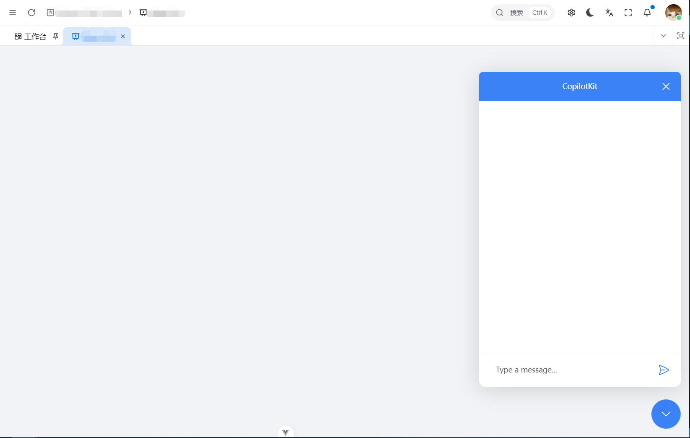

[English](./README.md) | [中文](./README.zh.md)

| Package                                 | NPM Version                                                                                                                               |
| :-------------------------------------- | :---------------------------------------------------------------------------------------------------------------------------------------- |
| `@dingdayu/vue-copilotkit-core`         | [](https://www.npmjs.com/package/@dingdayu/vue-copilotkit-core) |
| `@dingdayu/vue-copilotkit-ui`           | [](https://www.npmjs.com/package/@dingdayu/vue-copilotkit-ui)     |

---
# Vue Copilotkit

*此项目 fork 自 https://github.com/fe-51shebao/vue-copilotkit*

> 一个基于 <a href="https://github.com/CopilotKit/CopilotKit" target="_blank">CopilotKit</a> React UI 库的 Vue 实现。

`@dingdayu/vue-copilotkit-core` 和 `@dingdayu/vue-copilotkit-ui` 均已发布到 NPM 仓库，你可以使用以下命令将其添加到你的项目中：

```bash
pnpm add @dingdayu/vue-copilotkit-core @dingdayu/vue-copilotkit-ui
```

## 示例

### 服务端

安装依赖

```bash
pnpm add @copilotkit/runtime openai
```

创建 `index.js` 文件。

```ts
import { createServer } from 'node:http';
import {
    CopilotRuntime,
    OpenAIAdapter,
    copilotRuntimeNodeHttpEndpoint,
} from '@copilotkit/runtime';
import OpenAI from 'openai';

const openai = new OpenAI({
    apiKey: "sk-xxx", // 或者从环境变量 process.env["OPENAI_API_KEY"] 读取 API 密钥
    baseURL: "https://api.deepseek.com", // 可选：相关平台的 baseURL，例如阿里云百炼：https://dashscope.aliyuncs.com/compatible-mode/v1
});

// 测试时发现 CopilotKit 1.8.14 版本使用的是 this.openai.beta.chat.completions.stream
// 这会导致实际使用中出错，因此需要进行赋值。
openai.beta = openai;

// 注意这里的模型设置，例如 Qwen（通义千问）的模型：qwen-max-latest
const serviceAdapter = new OpenAIAdapter({ openai, model: "deepseek-chat", keepSystemRole: true, });

const server = createServer((req, res) => {
    const runtime = new CopilotRuntime({
        // 这是用于远程 Agent 的用法。如果你需要用其他语言实现，
        // 可以参考 CopilotKit 中的 sdk-python。
        // "remoteEndpoints": [
        //     {
        //         "url": "http://10.0.7.105:8005/copilotkit_remote",
        //     }
        // ]
    });
    const handler = copilotRuntimeNodeHttpEndpoint({
        endpoint: '/copilotkit',
        runtime,
        serviceAdapter,
    });

    return handler(req, res);
});

server.listen(4000, () => {
    console.log('监听地址 http://localhost:4000/copilotkit');
});
```

运行 `node index.js`。

### 客户端

安装依赖

```bash
pnpm add @dingdayu/vue-copilotkit-core @dingdayu/vue-copilotkit-ui
```

```diff
// app.vue
<script lang="ts" setup>
import { computed } from 'vue';

import { useAntdDesignTokens } from '@vben/hooks';
import { preferences, usePreferences } from '@vben/preferences';

+import { CopilotKit } from '@dingdayu/vue-copilotkit-core';
import { App, ConfigProvider, theme } from 'ant-design-vue';

import { antdLocale } from '#/locales';

defineOptions({ name: 'App' });

const { isDark } = usePreferences();
const { tokens } = useAntdDesignTokens();

const tokenTheme = computed(() => {
  const algorithm = isDark.value
    ? [theme.darkAlgorithm]
    : [theme.defaultAlgorithm];

  // antd 紧凑模式算法
  if (preferences.app.compact) {
    algorithm.push(theme.compactAlgorithm);
  }

  return {
    algorithm,
    token: tokens,
  };
});
</script>

<template>
  <ConfigProvider :locale="antdLocale" :theme="tokenTheme">
+    <CopilotKit
+      runtime-url="http://10.0.7.105:4000/copilotkit"
+      show-dev-console
+    >
      <App>
        <RouterView />
      </App>
+    </CopilotKit>
  </ConfigProvider>
</template>
```

在页面中使用。此示例使用 `CopilotPopup`，但也可以考虑使用 `CopilotChat` 或 `CopilotSidebar`。  
文档：https://docs.copilotkit.ai/reference/components/chat/CopilotChat

```diff
<script setup lang="ts">
import { Page } from '@vben/common-ui';

+import { CopilotPopup } from '@dingdayu/vue-copilotkit-ui';

// 如果需要，可以全局导入 CSS
+import '@dingdayu/vue-copilotkit-ui/style.css';
</script>

<template>
  <div>
    <Page>
+      <CopilotPopup />
    </Page>
  </div>
</template>
```

**Popup 效果:**

 

## 与上游版本的差异

1.  为 NPM 仓库发布重命名了包名
    *   `@copilotkit/vue-core` → `@dingdayu/vue-copilotkit-core`
    *   `@copilotkit/vue-ui` → `@dingdayu/vue-copilotkit-ui`
2.  将 @copilotkit/shared 及相关包升级到 `1.8.14`
3.  修复了 `Window` 组件导致的构建错误
4.  更新了 `vite.config.ts` 以解决由 vite 内联导致的 `injection "Symbol()" not found` 问题
5.  修复了因 `CopilotRuntimeClient` 使用不当导致的 `asStream` 未找到的问题
6.  修复了与 `view.docView.domFromPos` 相关的问题
7.  在 `package.json` 中添加了仓库信息