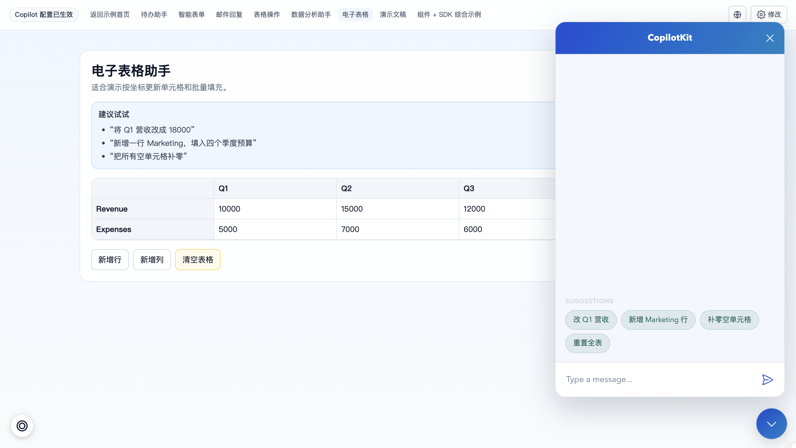
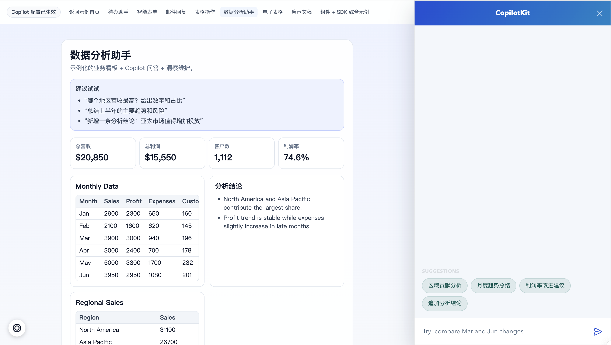

[English](./README.md) | [中文](./README.zh.md)

| Package                         | 状态    | NPM Version                                                                                                                                                                 |
| :------------------------------ | :------ | :-------------------------------------------------------------------------------------------------------------------------------------------------------------------------- |
| `@dingdayu/vue-copilotkit`      | 🟢 活跃 | [](https://www.npmjs.com/package/@dingdayu/vue-copilotkit)                |
| `@dingdayu/vue-copilotkit-core` | 🔴 弃用 | [](https://www.npmjs.com/package/@dingdayu/vue-copilotkit-core) |
| `@dingdayu/vue-copilotkit-ui`   | 🔴 弃用 | [](https://www.npmjs.com/package/@dingdayu/vue-copilotkit-ui)       |

---

# Vue CopilotKit

Vue CopilotKit 是一个受 [CopilotKit](https://github.com/CopilotKit/CopilotKit) React UI 层启发的 Vue 3 实现。这个仓库为新项目提供统一包，同时保留旧的拆分包以兼容已有集成。

> 新项目推荐直接使用：`@dingdayu/vue-copilotkit`

## 这个仓库提供什么？

- 统一包，包含 Provider、composables、聊天 UI、Popup / Sidebar 和 `CopilotTextarea`
- 基于 Vue 3 + Vite 的双语示例应用，覆盖多个实际场景
- 兼容 CopilotKit v2 single-route runtime 协议
- 基于 pnpm monorepo，方便统一开发、构建和发布

## 安装

```bash
pnpm add @dingdayu/vue-copilotkit
```

如果你仍需要旧的拆分包，它们依然可以使用，但已经标记为弃用：

```bash
pnpm add @dingdayu/vue-copilotkit-core @dingdayu/vue-copilotkit-ui
```

## 快速开始

### 运行本地示例

```bash
pnpm install

# 终端 1：启动本地 runtime
pnpm -C examples dev:runtime

# 终端 2：启动 Vue 示例应用
pnpm dev
```

常用工作区命令：

- `pnpm dev`：从仓库根目录启动 Vite 示例应用
- `pnpm -C examples dev:runtime`：启动示例默认使用的本地 CopilotKit runtime
- `pnpm typecheck`：执行根级 TypeScript 检查
- `pnpm build`：通过 Turbo 构建整个 workspace

本地 runtime 默认地址：`http://localhost:4000/copilotkit`

## 仓库结构

| 路径                         | 说明                                                          |
| :--------------------------- | :------------------------------------------------------------ |
| `packages/vue-copilotkit`    | 推荐使用的统一包：Provider、composables、chat UI、textarea 等 |
| `packages/vue-core`          | 已弃用的 core 包，保留底层 runtime 集成与 composables         |
| `packages/vue-ui`            | 已弃用的 UI 包，保留 chat、popup/sidebar 和 textarea 组件     |
| `examples`                   | Vue 3 + Vite 双语示例应用，包含多个场景页面                   |
| `README.md` / `README.zh.md` | 面向外部用户的中英文项目文档                                  |

## 包说明

- `@dingdayu/vue-copilotkit`：推荐入口，统一导出 Provider、composables、聊天 UI、Popup、Sidebar 和 `CopilotTextarea`
- `@dingdayu/vue-copilotkit-core`：历史遗留的底层 Provider 与 runtime hooks 包
- `@dingdayu/vue-copilotkit-ui`：历史遗留的预构建 UI 包

延伸阅读：

- [`packages/vue-copilotkit/README.md`](./packages/vue-copilotkit/README.md)
- [`packages/vue-core/README.md`](./packages/vue-core/README.md)
- [`packages/vue-ui/README.md`](./packages/vue-ui/README.md)
- [`examples/README.md`](./examples/README.md)

## 集成示例

### 1. 服务端 runtime

安装 runtime 相关依赖：

```bash
pnpm add @copilotkit/runtime @ai-sdk/openai-compatible
```

创建 `index.mjs` 文件（或者在 `package.json` 中启用 `"type": "module"`）：

```ts
import { createServer } from 'node:http'
import { CopilotRuntime, copilotRuntimeNodeHttpEndpoint } from '@copilotkit/runtime'
import { BuiltInAgent } from '@copilotkit/runtime/v2'
import { createOpenAICompatible } from '@ai-sdk/openai-compatible'

const provider = createOpenAICompatible({
  name: 'openai-compatible',
  apiKey: process.env.OPENAI_API_KEY,
  baseURL: process.env.OPENAI_BASE_URL || 'https://api.openai.com/v1',
})

const runtime = new CopilotRuntime({
  agents: {
    default: new BuiltInAgent({
      model: provider.chatModel(process.env.OPENAI_MODEL || 'deepseek-chat'),
      forwardSystemMessages: true,
    }),
  },
})

const handler = copilotRuntimeNodeHttpEndpoint({
  endpoint: '/copilotkit',
  runtime,
})

const server = createServer((req, res) => handler(req, res))
server.listen(4000, () => {
  console.log('Listening at http://localhost:4000/copilotkit')
})
```

运行方式：

```bash
node index.mjs
```

### 2. 客户端接入

安装统一包：

```bash
pnpm add @dingdayu/vue-copilotkit
```

使用 `CopilotKit` 包裹应用，并指向你的 runtime 地址：

```vue
<script lang="ts" setup>
import { computed } from 'vue'
import { App, ConfigProvider, theme } from 'ant-design-vue'
import { CopilotKit } from '@dingdayu/vue-copilotkit'

const tokenTheme = computed(() => ({
  algorithm: [theme.defaultAlgorithm],
}))
</script>

<template>
  <ConfigProvider :theme="tokenTheme">
    <CopilotKit runtime-url="http://localhost:4000/copilotkit" show-dev-console>
      <App>
        <RouterView />
      </App>
    </CopilotKit>
  </ConfigProvider>
</template>
```

在需要的位置渲染现成 UI 组件：

```vue
<script setup lang="ts">
import { CopilotPopup } from '@dingdayu/vue-copilotkit'
</script>

<template>
  <CopilotPopup />
</template>
```

如果你从包根入口导入，样式会自动引入；如果只使用子路径导入，请手动添加：

```ts
import '@dingdayu/vue-copilotkit/style.css'
```

### UI 截图

| Popup                                          | Sidebar                                            |
| :--------------------------------------------- | :------------------------------------------------- |
|  |  |

如果需要补充 `examples` 页面截图，统一存放到 `docs/screenshots/examples/`，并在 `examples/README.md` 中引用。

## CopilotKit v2 协议说明

官方文档：https://docs.copilotkit.ai/reference/v2

本仓库遵循 runtime 端点使用的 v2 single-route 请求格式：

```json
{
  "method": "agent/run",
  "params": { "agentId": "default" },
  "body": {
    "threadId": "...",
    "runId": "...",
    "messages": [],
    "tools": [],
    "context": [],
    "state": {},
    "forwardedProps": {}
  }
}
```

single-route 支持的 `method`：

- `agent/run`
- `agent/connect`
- `agent/stop`
- `info`
- `transcribe`

该端点只接受 JSON envelope（`Content-Type: application/json`），非 JSON 请求会返回 `invalid_request`。

## 示例应用说明

`examples/` 目录下的示例应用包含：

- 双语界面（`en` / `zh`）
- 顶部工具栏中的 runtime URL 和 API key 配置
- todo、form、textarea、table、spreadsheet、presentation、SDK 等场景页面

更多路由和运行说明见 [`examples/README.md`](./examples/README.md)。

## 参与贡献

欢迎贡献。请先阅读 [`CONTRIBUTING.md`](./CONTRIBUTING.md) 了解本地开发流程、编码规范和 PR 前检查项。

## 与上游版本的差异

_此项目 fork 自 https://github.com/fe-51shebao/vue-copilotkit_

1. 为 npm 发布重命名了包名
   - `@copilotkit/vue-core` → `@dingdayu/vue-copilotkit-core`
   - `@copilotkit/vue-ui` → `@dingdayu/vue-copilotkit-ui`
2. 新增统一包 `@dingdayu/vue-copilotkit`，作为推荐接入方式
3. 将 CopilotKit runtime/client 相关包升级到 `1.53.0`，兼容 v2 协议
4. 修复了与 `Window` 相关的构建问题
5. 移除了原共享 `vite-config` 包，并将所需 Vite 配置内联到各个包中
6. 将 chat 和 textarea 的数据链路迁移到 v2 single-route 协议（`method: agent/run`）
7. 修复了 `view.docView.domFromPos` 相关问题
8. 在包清单中补充了仓库元信息
9. 重做了示例应用，加入双语导航、共享 runtime 配置和更完整的场景页面

## 迁移提示

- 新项目优先使用 `@dingdayu/vue-copilotkit`
- 如果你之前使用独立 textarea 包，请改为从 `@dingdayu/vue-copilotkit` 或 `@dingdayu/vue-copilotkit-ui` 导入 `CopilotTextarea`
- 聊天与 textarea 的共享样式仍可通过 `@dingdayu/vue-copilotkit/style.css` 引入
- 如果你依赖已移除的共享 Vite 配置包，请把需要的构建配置复制到自己的包配置中

## 发布

这是一个 pnpm monorepo，实际发布的包位于 `packages/*`。

```bash
pnpm install
pnpm build
pnpm publish:packages
```

发布前请确认：

- 已执行 `npm login`
- 已更新相关 `packages/*/package.json` 中的版本号
- 整个 workspace 可以正常构建
